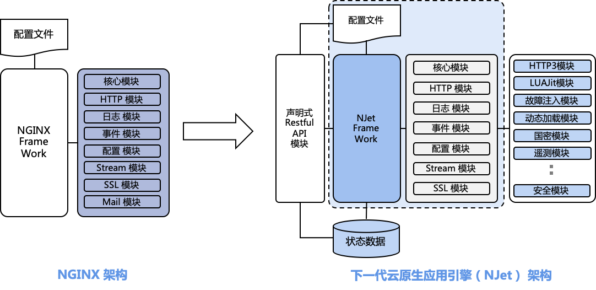
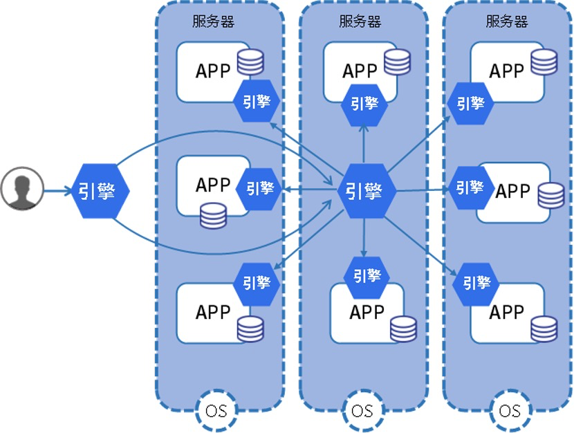
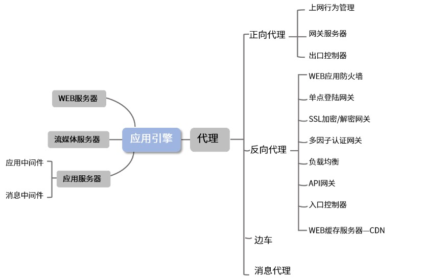

# **OpenNJet 介绍**

OpenNJet 应用引擎是基于 NGINX 的面向互联网和云原生应用提供的运行时组态服务程序。具备环境感知、安全控制、加速优化等能力，作为底层引擎，OpenNJet 利用动态加载机制可以实现不同的产品形态，如API网关、消息代理、出入向代理，负载均衡，WAF等等。在云原生架构中，OpenNJet 除了提供南北向通信网关的功能以外，还提供了服务网格中东西向通信、透明流量劫持、熔断、遥测与故障注入等新功能特性。 

OpenNJet 最早是基于 NGINX1.19 基础 fork 并独立演进，随着 NGINX 版本迭代，吸收上游 NGINX 的更新，已经同步更新到 NGINX1.23.1 版本，OpenNJet 具有高性能、稳定、易扩展的特点，同时也解决了 NGINX 长期存在的难于动态配置、管理功能影响业务等问题。我们目标在于适应国内特定的技术规范及标准，如国密算法套件支持、构建安全可控的云原生数据面，支撑我国云原生产业生态。

# 🏗️ 技术架构

# ✨ **功能特性**   

<table class="MsoNormalTable" border="0" cellspacing="0" cellpadding="0" width="525" style="width:394.0pt;border-collapse:collapse;mso-yfti-tbllook:1184;
 mso-padding-alt:0cm 5.4pt 0cm 5.4pt">
 <tbody><tr style="mso-yfti-irow:0;mso-yfti-firstrow:yes;height:16.0pt">
  <td width="525" nowrap="" colspan="2" style="width:394.0pt;border:solid windowtext 1.0pt;
  mso-border-alt:solid windowtext .5pt;padding:0cm 5.4pt 0cm 5.4pt;height:16.0pt">
  
<b>继承 nginx-1.23.1 所有功能， 并且100%兼容nginx<o:p></o:p></b>

  </td>
 </tr>
 <tr style="mso-yfti-irow:1;height:16.0pt">
  <td width="525" nowrap="" colspan="2" style="width:394.0pt;border:solid windowtext 1.0pt;
  border-top:none;mso-border-top-alt:solid windowtext .5pt;mso-border-alt:solid windowtext .5pt;
  padding:0cm 5.4pt 0cm 5.4pt;height:16.0pt">
  
<b>OpenNJet</b><b> </b><b>功能特性<o:p></o:p></b>

  </td>
 </tr>
 <tr style="mso-yfti-irow:2;height:17.0pt">
  <td width="203" nowrap="" rowspan="2" style="width:152.15pt;border:solid windowtext 1.0pt;
  border-top:none;mso-border-left-alt:solid windowtext .5pt;mso-border-bottom-alt:
  solid windowtext .5pt;mso-border-right-alt:solid windowtext .5pt;padding:
  0cm 5.4pt 0cm 5.4pt;height:17.0pt">
  
Copilot框架<o:p></o:p>

  </td>
  <td width="322" style="width:241.85pt;border-top:none;border-left:none;
  border-bottom:solid windowtext 1.0pt;border-right:solid windowtext 1.0pt;
  mso-border-bottom-alt:solid windowtext .5pt;mso-border-right-alt:solid windowtext .5pt;
  padding:0cm 5.4pt 0cm 5.4pt;height:17.0pt">
  
支持动态加载不同的外部copilot模块<o:p></o:p>

  </td>
 </tr>
 <tr style="mso-yfti-irow:3;height:17.0pt">
  <td width="322" style="width:241.85pt;border-top:none;border-left:none;
  border-bottom:solid windowtext 1.0pt;border-right:solid windowtext 1.0pt;
  mso-border-bottom-alt:solid windowtext .5pt;mso-border-right-alt:solid windowtext .5pt;
  padding:0cm 5.4pt 0cm 5.4pt;height:17.0pt">
  
支持外部模块异常退出的自动重启<o:p></o:p>

  </td>
 </tr>
 <tr style="mso-yfti-irow:4;height:17.0pt">
  <td width="203" nowrap="" rowspan="2" style="width:152.15pt;border:solid windowtext 1.0pt;
  border-top:none;mso-border-left-alt:solid windowtext .5pt;mso-border-bottom-alt:
  solid windowtext .5pt;mso-border-right-alt:solid windowtext .5pt;padding:
  0cm 5.4pt 0cm 5.4pt;height:17.0pt">
  
KV模块<o:p></o:p>

  </td>
  <td width="322" style="width:241.85pt;border-top:none;border-left:none;
  border-bottom:solid windowtext 1.0pt;border-right:solid windowtext 1.0pt;
  mso-border-bottom-alt:solid windowtext .5pt;mso-border-right-alt:solid windowtext .5pt;
  padding:0cm 5.4pt 0cm 5.4pt;height:17.0pt">
  
支持键值的查询及设置<o:p></o:p>

  </td>
 </tr>
 <tr style="mso-yfti-irow:5;height:17.0pt">
  <td width="322" style="width:241.85pt;border-top:none;border-left:none;
  border-bottom:solid windowtext 1.0pt;border-right:solid windowtext 1.0pt;
  mso-border-bottom-alt:solid windowtext .5pt;mso-border-right-alt:solid windowtext .5pt;
  padding:0cm 5.4pt 0cm 5.4pt;height:17.0pt">
  
支持键值的持久化<o:p></o:p>

  </td>
 </tr>
 <tr style="mso-yfti-irow:6;height:17.0pt">
  <td width="203" nowrap="" rowspan="3" style="width:152.15pt;border:solid windowtext 1.0pt;
  border-top:none;mso-border-left-alt:solid windowtext .5pt;mso-border-bottom-alt:
  solid windowtext .5pt;mso-border-right-alt:solid windowtext .5pt;padding:
  0cm 5.4pt 0cm 5.4pt;height:17.0pt">
  
动态配置框架<o:p></o:p>

  </td>
  <td width="322" style="width:241.85pt;border-top:none;border-left:none;
  border-bottom:solid windowtext 1.0pt;border-right:solid windowtext 1.0pt;
  mso-border-bottom-alt:solid windowtext .5pt;mso-border-right-alt:solid windowtext .5pt;
  padding:0cm 5.4pt 0cm 5.4pt;height:17.0pt">
  
支持控制平面的消息发送<o:p></o:p>

  </td>
 </tr>
 <tr style="mso-yfti-irow:7;height:17.0pt">
  <td width="322" style="width:241.85pt;border-top:none;border-left:none;
  border-bottom:solid windowtext 1.0pt;border-right:solid windowtext 1.0pt;
  mso-border-bottom-alt:solid windowtext .5pt;mso-border-right-alt:solid windowtext .5pt;
  padding:0cm 5.4pt 0cm 5.4pt;height:17.0pt">
  
支持RPC消息、组播消息<o:p></o:p>

  </td>
 </tr>
 <tr style="mso-yfti-irow:8;height:17.0pt">
  <td width="322" style="width:241.85pt;border-top:none;border-left:none;
  border-bottom:solid windowtext 1.0pt;border-right:solid windowtext 1.0pt;
  mso-border-bottom-alt:solid windowtext .5pt;mso-border-right-alt:solid windowtext .5pt;
  padding:0cm 5.4pt 0cm 5.4pt;height:17.0pt">
  
支持消息持久化<o:p></o:p>

  </td>
 </tr>
 <tr style="mso-yfti-irow:9;height:17.0pt">
  <td width="203" nowrap="" rowspan="3" style="width:152.15pt;border:solid windowtext 1.0pt;
  border-top:none;mso-border-left-alt:solid windowtext .5pt;mso-border-bottom-alt:
  solid windowtext .5pt;mso-border-right-alt:solid windowtext .5pt;padding:
  0cm 5.4pt 0cm 5.4pt;height:17.0pt">
  
Cache-purge<o:p></o:p>

  </td>
  <td width="322" style="width:241.85pt;border-top:none;border-left:none;
  border-bottom:solid windowtext 1.0pt;border-right:solid windowtext 1.0pt;
  mso-border-bottom-alt:solid windowtext .5pt;mso-border-right-alt:solid windowtext .5pt;
  padding:0cm 5.4pt 0cm 5.4pt;height:17.0pt">
  
支持缓存清理<o:p></o:p>

  </td>
 </tr>
 <tr style="mso-yfti-irow:10;height:17.0pt">
  <td width="322" style="width:241.85pt;border-top:none;border-left:none;
  border-bottom:solid windowtext 1.0pt;border-right:solid windowtext 1.0pt;
  mso-border-bottom-alt:solid windowtext .5pt;mso-border-right-alt:solid windowtext .5pt;
  padding:0cm 5.4pt 0cm 5.4pt;height:17.0pt">
  
支持按指定前缀清理缓存<o:p></o:p>

  </td>
 </tr>
 <tr style="mso-yfti-irow:11;height:17.0pt">
  <td width="322" style="width:241.85pt;border-top:none;border-left:none;
  border-bottom:solid windowtext 1.0pt;border-right:solid windowtext 1.0pt;
  mso-border-bottom-alt:solid windowtext .5pt;mso-border-right-alt:solid windowtext .5pt;
  padding:0cm 5.4pt 0cm 5.4pt;height:17.0pt">
  
开启分片后修改源文件不会造成下载失败<o:p></o:p>

  </td>
 </tr>
 <tr style="mso-yfti-irow:12;height:34.0pt">
  <td width="203" nowrap="" rowspan="7" style="width:152.15pt;border:solid windowtext 1.0pt;
  border-top:none;mso-border-left-alt:solid windowtext .5pt;mso-border-bottom-alt:
  solid windowtext .5pt;mso-border-right-alt:solid windowtext .5pt;padding:
  0cm 5.4pt 0cm 5.4pt;height:34.0pt">
  
health_check<o:p></o:p>

  </td>
  <td width="322" style="width:241.85pt;border-top:none;border-left:none;
  border-bottom:solid windowtext 1.0pt;border-right:solid windowtext 1.0pt;
  mso-border-bottom-alt:solid windowtext .5pt;mso-border-right-alt:solid windowtext .5pt;
  padding:0cm 5.4pt 0cm 5.4pt;height:34.0pt">
  
支持单独在helper进程开启健康检查，不影响数据面业务<o:p></o:p>

  </td>
 </tr>
 <tr style="mso-yfti-irow:13;height:17.0pt">
  <td width="322" style="width:241.85pt;border-top:none;border-left:none;
  border-bottom:solid windowtext 1.0pt;border-right:solid windowtext 1.0pt;
  mso-border-bottom-alt:solid windowtext .5pt;mso-border-right-alt:solid windowtext .5pt;
  padding:0cm 5.4pt 0cm 5.4pt;height:17.0pt">
  
支持运行时动态开启或关闭健康检查功能<o:p></o:p>

  </td>
 </tr>
 <tr style="mso-yfti-irow:14;height:17.0pt">
  <td width="322" style="width:241.85pt;border-top:none;border-left:none;
  border-bottom:solid windowtext 1.0pt;border-right:solid windowtext 1.0pt;
  mso-border-bottom-alt:solid windowtext .5pt;mso-border-right-alt:solid windowtext .5pt;
  padding:0cm 5.4pt 0cm 5.4pt;height:17.0pt">
  
支持校验返回http code<o:p></o:p>

  </td>
 </tr>
 <tr style="mso-yfti-irow:15;height:17.0pt">
  <td width="322" style="width:241.85pt;border-top:none;border-left:none;
  border-bottom:solid windowtext 1.0pt;border-right:solid windowtext 1.0pt;
  mso-border-bottom-alt:solid windowtext .5pt;mso-border-right-alt:solid windowtext .5pt;
  padding:0cm 5.4pt 0cm 5.4pt;height:17.0pt">
  
支持校验返回http header<o:p></o:p>

  </td>
 </tr>
 <tr style="mso-yfti-irow:16;height:17.0pt">
  <td width="322" style="width:241.85pt;border-top:none;border-left:none;
  border-bottom:solid windowtext 1.0pt;border-right:solid windowtext 1.0pt;
  mso-border-bottom-alt:solid windowtext .5pt;mso-border-right-alt:solid windowtext .5pt;
  padding:0cm 5.4pt 0cm 5.4pt;height:17.0pt">
  
支持校验返回http body<o:p></o:p>

  </td>
 </tr>
 <tr style="mso-yfti-irow:17;height:17.0pt">
  <td width="322" style="width:241.85pt;border-top:none;border-left:none;
  border-bottom:solid windowtext 1.0pt;border-right:solid windowtext 1.0pt;
  mso-border-bottom-alt:solid windowtext .5pt;mso-border-right-alt:solid windowtext .5pt;
  padding:0cm 5.4pt 0cm 5.4pt;height:17.0pt">
  
支持https健康检查<o:p></o:p>

  </td>
 </tr>
 <tr style="mso-yfti-irow:17;height:17.0pt">
  <td width="322" style="width:241.85pt;border-top:none;border-left:none;
  border-bottom:solid windowtext 1.0pt;border-right:solid windowtext 1.0pt;
  mso-border-bottom-alt:solid windowtext .5pt;mso-border-right-alt:solid windowtext .5pt;
  padding:0cm 5.4pt 0cm 5.4pt;height:17.0pt">
  
支持强制健康检查，以及持久化功能<o:p></o:p>

  </td>
 </tr>
 <tr style="mso-yfti-irow:18;height:17.0pt">
  <td width="322" style="width:241.85pt;border-top:none;border-left:none;
  border-bottom:solid windowtext 1.0pt;border-right:solid windowtext 1.0pt;
  mso-border-bottom-alt:solid windowtext .5pt;mso-border-right-alt:solid windowtext .5pt;
  padding:0cm 5.4pt 0cm 5.4pt;height:17.0pt">
  
支持国密https健康检查<o:p></o:p>

  </td>
 </tr>
 <tr style="mso-yfti-irow:19;height:17.0pt">
  <td width="203" nowrap="" rowspan="2" style="width:152.15pt;border:solid windowtext 1.0pt;
  border-top:none;mso-border-left-alt:solid windowtext .5pt;mso-border-bottom-alt:
  solid windowtext .5pt;mso-border-right-alt:solid windowtext .5pt;padding:
  0cm 5.4pt 0cm 5.4pt;height:17.0pt">
  
Split-clients-2<o:p></o:p>

  </td>
  <td width="322" style="width:241.85pt;border-top:none;border-left:none;
  border-bottom:solid windowtext 1.0pt;border-right:solid windowtext 1.0pt;
  mso-border-bottom-alt:solid windowtext .5pt;mso-border-right-alt:solid windowtext .5pt;
  padding:0cm 5.4pt 0cm 5.4pt;height:17.0pt">
  
支持蓝绿发布<o:p></o:p>

  </td>
 </tr>
 <tr style="mso-yfti-irow:20;height:17.0pt">
  <td width="322" style="width:241.85pt;border-top:none;border-left:none;
  border-bottom:solid windowtext 1.0pt;border-right:solid windowtext 1.0pt;
  mso-border-bottom-alt:solid windowtext .5pt;mso-border-right-alt:solid windowtext .5pt;
  padding:0cm 5.4pt 0cm 5.4pt;height:17.0pt">
  
支持运行时动态调整流量比例<o:p></o:p>

  </td>
 </tr>
 <tr style="mso-yfti-irow:21;height:17.0pt">
  <td width="203" nowrap="" rowspan="3" style="width:152.15pt;border:solid windowtext 1.0pt;
  border-top:none;mso-border-left-alt:solid windowtext .5pt;mso-border-bottom-alt:
  solid windowtext .5pt;mso-border-right-alt:solid windowtext .5pt;padding:
  0cm 5.4pt 0cm 5.4pt;height:17.0pt">
  
黑白名单<o:p></o:p>

  </td>
  <td width="322" style="width:241.85pt;border-top:none;border-left:none;
  border-bottom:solid windowtext 1.0pt;border-right:solid windowtext 1.0pt;
  mso-border-bottom-alt:solid windowtext .5pt;mso-border-right-alt:solid windowtext .5pt;
  padding:0cm 5.4pt 0cm 5.4pt;height:17.0pt">
  
支持黑名单方式进行访问IP的限制<o:p></o:p>

  </td>
 </tr>
 <tr style="mso-yfti-irow:22;height:17.0pt">
  <td width="322" style="width:241.85pt;border-top:none;border-left:none;
  border-bottom:solid windowtext 1.0pt;border-right:solid windowtext 1.0pt;
  mso-border-bottom-alt:solid windowtext .5pt;mso-border-right-alt:solid windowtext .5pt;
  padding:0cm 5.4pt 0cm 5.4pt;height:17.0pt">
  
支持白名单方式进行访问IP的限制<o:p></o:p>

  </td>
 </tr>
 <tr style="mso-yfti-irow:23;height:17.0pt">
  <td width="322" style="width:241.85pt;border-top:none;border-left:none;
  border-bottom:solid windowtext 1.0pt;border-right:solid windowtext 1.0pt;
  mso-border-bottom-alt:solid windowtext .5pt;mso-border-right-alt:solid windowtext .5pt;
  padding:0cm 5.4pt 0cm 5.4pt;height:17.0pt">
  
&nbsp;支持运行时动态设置IPv4的黑白名单列表 <o:p></o:p>

  </td>
 </tr>
 <tr style="mso-yfti-irow:24;height:34.0pt">
  <td width="203" nowrap="" rowspan="3" style="width:152.15pt;border:solid windowtext 1.0pt;
  border-top:none;mso-border-left-alt:solid windowtext .5pt;mso-border-bottom-alt:
  solid windowtext .5pt;mso-border-right-alt:solid windowtext .5pt;padding:
  0cm 5.4pt 0cm 5.4pt;height:34.0pt">
  
doc模块<o:p></o:p>

  </td>
  <td width="322" style="width:241.85pt;border-top:none;border-left:none;
  border-bottom:solid windowtext 1.0pt;border-right:solid windowtext 1.0pt;
  mso-border-bottom-alt:solid windowtext .5pt;mso-border-right-alt:solid windowtext .5pt;
  padding:0cm 5.4pt 0cm 5.4pt;height:34.0pt">
  
支持location 级别通过doc_api 指令配置，实现对swagger、gui页面的访问<o:p></o:p>

  </td>
 </tr>
 <tr style="mso-yfti-irow:25;height:34.0pt">
  <td width="322" style="width:241.85pt;border-top:none;border-left:none;
  border-bottom:solid windowtext 1.0pt;border-right:solid windowtext 1.0pt;
  mso-border-bottom-alt:solid windowtext .5pt;mso-border-right-alt:solid windowtext .5pt;
  padding:0cm 5.4pt 0cm 5.4pt;height:34.0pt">
  
支持通过swagger 页面实现对各功能opentapi的访问<o:p></o:p>

  </td>
 </tr>
 <tr style="mso-yfti-irow:26;height:34.0pt">
  <td width="322" style="width:241.85pt;border-top:none;border-left:none;
  border-bottom:solid windowtext 1.0pt;border-right:solid windowtext 1.0pt;
  mso-border-bottom-alt:solid windowtext .5pt;mso-border-right-alt:solid windowtext .5pt;
  padding:0cm 5.4pt 0cm 5.4pt;height:34.0pt">
  
支持通过gui页面实现对动态模块配置修改的能力<o:p></o:p>

  </td>
 </tr>
 <tr style="mso-yfti-irow:27;height:17.0pt">
  <td width="203" nowrap="" rowspan="2" style="width:152.15pt;border:solid windowtext 1.0pt;
  border-top:none;mso-border-left-alt:solid windowtext .5pt;mso-border-bottom-alt:
  solid windowtext .5pt;mso-border-right-alt:solid windowtext .5pt;padding:
  0cm 5.4pt 0cm 5.4pt;height:17.0pt">
  
telemetry（外部编译模块）<o:p></o:p>

  </td>
  <td width="322" style="width:241.85pt;border-top:none;border-left:none;
  border-bottom:solid windowtext 1.0pt;border-right:solid windowtext 1.0pt;
  mso-border-bottom-alt:solid windowtext .5pt;mso-border-right-alt:solid windowtext .5pt;
  padding:0cm 5.4pt 0cm 5.4pt;height:17.0pt">
  
支持http请求在不同server间的服务追踪<o:p></o:p>

  </td>
 </tr>
 <tr style="mso-yfti-irow:28;height:17.0pt">
  <td width="322" style="width:241.85pt;border-top:none;border-left:none;
  border-bottom:solid windowtext 1.0pt;border-right:solid windowtext 1.0pt;
  mso-border-bottom-alt:solid windowtext .5pt;mso-border-right-alt:solid windowtext .5pt;
  padding:0cm 5.4pt 0cm 5.4pt;height:17.0pt">
  
支持动态开关控制调用链的生成<o:p></o:p>

  </td>
 </tr>
 <tr style="mso-yfti-irow:29;height:34.0pt">
  <td width="203" nowrap="" style="width:152.15pt;border:solid windowtext 1.0pt;
  border-top:none;mso-border-left-alt:solid windowtext .5pt;mso-border-bottom-alt:
  solid windowtext .5pt;mso-border-right-alt:solid windowtext .5pt;padding:
  0cm 5.4pt 0cm 5.4pt;height:34.0pt">
  
正向代理（支持http/https）<o:p></o:p>

  </td>
  <td width="322" style="width:241.85pt;border-top:none;border-left:none;
  border-bottom:solid windowtext 1.0pt;border-right:solid windowtext 1.0pt;
  mso-border-bottom-alt:solid windowtext .5pt;mso-border-right-alt:solid windowtext .5pt;
  padding:0cm 5.4pt 0cm 5.4pt;height:34.0pt">
  
实现了HTTP CONNECT 方法支持http/https正向代理访问<o:p></o:p>

  </td>
 </tr>
 <tr style="mso-yfti-irow:30;height:85.0pt">
  <td width="203" nowrap="" rowspan="5" style="width:152.15pt;border:solid windowtext 1.0pt;
  border-top:none;mso-border-left-alt:solid windowtext .5pt;mso-border-bottom-alt:
  solid windowtext .5pt;mso-border-right-alt:solid windowtext .5pt;padding:
  0cm 5.4pt 0cm 5.4pt;height:85.0pt">
  
vts模块<o:p></o:p>

  </td>
  <td width="322" style="width:241.85pt;border-top:none;border-left:none;
  border-bottom:solid windowtext 1.0pt;border-right:solid windowtext 1.0pt;
  mso-border-bottom-alt:solid windowtext .5pt;mso-border-right-alt:solid windowtext .5pt;
  padding:0cm 5.4pt 0cm 5.4pt;height:85.0pt">
  
支持server的request、response、traffic、cache信息的统计，其中server的response可以按照response code进行分类统计，分类统计使用的response code为1xx、2xx、3xx、4xx、5xx<o:p></o:p>

  </td>
 </tr>
 <tr style="mso-yfti-irow:31;height:17.0pt">
  <td width="322" style="width:241.85pt;border-top:none;border-left:none;
  border-bottom:solid windowtext 1.0pt;border-right:solid windowtext 1.0pt;
  mso-border-bottom-alt:solid windowtext .5pt;mso-border-right-alt:solid windowtext .5pt;
  padding:0cm 5.4pt 0cm 5.4pt;height:17.0pt">
  
支持upstream和cache信息的统计<o:p></o:p>

  </td>
 </tr>
 <tr style="mso-yfti-irow:32;height:17.0pt">
  <td width="322" style="width:241.85pt;border-top:none;border-left:none;
  border-bottom:solid windowtext 1.0pt;border-right:solid windowtext 1.0pt;
  mso-border-bottom-alt:solid windowtext .5pt;mso-border-right-alt:solid windowtext .5pt;
  padding:0cm 5.4pt 0cm 5.4pt;height:17.0pt">
  
支持通过内嵌的html页面进行统计信息的展示<o:p></o:p>

  </td>
 </tr>
 <tr style="mso-yfti-irow:33;height:34.0pt">
  <td width="322" style="width:241.85pt;border-top:none;border-left:none;
  border-bottom:solid windowtext 1.0pt;border-right:solid windowtext 1.0pt;
  mso-border-bottom-alt:solid windowtext .5pt;mso-border-right-alt:solid windowtext .5pt;
  padding:0cm 5.4pt 0cm 5.4pt;height:34.0pt">
  
支持通过Prometheus、grafana进行统计信息的展示<o:p></o:p>

  </td>
 </tr>
 <tr style="mso-yfti-irow:34;height:34.0pt">
  <td width="322" style="width:241.85pt;border-top:none;border-left:none;
  border-bottom:solid windowtext 1.0pt;border-right:solid windowtext 1.0pt;
  mso-border-bottom-alt:solid windowtext .5pt;mso-border-right-alt:solid windowtext .5pt;
  padding:0cm 5.4pt 0cm 5.4pt;height:34.0pt">
  
支持动态配置server的location统计开关，支持动态配置server的filter key<o:p></o:p>

  </td>
 </tr>
 <tr style="mso-yfti-irow:35;height:17.0pt">
  <td width="203" nowrap="" rowspan="4" style="width:152.15pt;border:solid windowtext 1.0pt;
  border-top:none;mso-border-left-alt:solid windowtext .5pt;mso-border-bottom-alt:
  solid windowtext .5pt;mso-border-right-alt:solid windowtext .5pt;padding:
  0cm 5.4pt 0cm 5.4pt;height:17.0pt">
  
国密支持<o:p></o:p>

  </td>
  <td width="322" style="width:241.85pt;border-top:none;border-left:none;
  border-bottom:solid windowtext 1.0pt;border-right:solid windowtext 1.0pt;
  mso-border-bottom-alt:solid windowtext .5pt;mso-border-right-alt:solid windowtext .5pt;
  padding:0cm 5.4pt 0cm 5.4pt;height:17.0pt">
  
支持server中使用国密<o:p></o:p>

  </td>
 </tr>
 <tr style="mso-yfti-irow:36;height:17.0pt">
  <td width="322" style="width:241.85pt;border-top:none;border-left:none;
  border-bottom:solid windowtext 1.0pt;border-right:solid windowtext 1.0pt;
  mso-border-bottom-alt:solid windowtext .5pt;mso-border-right-alt:solid windowtext .5pt;
  padding:0cm 5.4pt 0cm 5.4pt;height:17.0pt">
  
支持反向代理中使用国密<o:p></o:p>

  </td>
 </tr>
 <tr style="mso-yfti-irow:37;height:17.0pt">
  <td width="322" style="width:241.85pt;border-top:none;border-left:none;
  border-bottom:solid windowtext 1.0pt;border-right:solid windowtext 1.0pt;
  mso-border-bottom-alt:solid windowtext .5pt;mso-border-right-alt:solid windowtext .5pt;
  padding:0cm 5.4pt 0cm 5.4pt;height:17.0pt">
  
支持国密双证证书<o:p></o:p>

  </td>
 </tr>
 <tr style="mso-yfti-irow:38;height:17.0pt">
  <td width="322" style="width:241.85pt;border-top:none;border-left:none;
  border-bottom:solid windowtext 1.0pt;border-right:solid windowtext 1.0pt;
  mso-border-bottom-alt:solid windowtext .5pt;mso-border-right-alt:solid windowtext .5pt;
  padding:0cm 5.4pt 0cm 5.4pt;height:17.0pt">
  
动态（国密）证书更新<o:p></o:p>

  </td>
 </tr>
 <tr style="mso-yfti-irow:39;height:17.0pt">
  <td width="203" nowrap="" rowspan="6" style="width:152.15pt;border:solid windowtext 1.0pt;
  border-top:none;mso-border-left-alt:solid windowtext .5pt;mso-border-bottom-alt:
  solid windowtext .5pt;mso-border-right-alt:solid windowtext .5pt;padding:
  0cm 5.4pt 0cm 5.4pt;height:17.0pt">
  
动态access log<o:p></o:p>

  </td>
  <td width="322" style="width:241.85pt;border-top:none;border-left:none;
  border-bottom:solid windowtext 1.0pt;border-right:solid windowtext 1.0pt;
  mso-border-bottom-alt:solid windowtext .5pt;mso-border-right-alt:solid windowtext .5pt;
  padding:0cm 5.4pt 0cm 5.4pt;height:17.0pt">
  
支持运行中动态关闭access log功能<o:p></o:p>

  </td>
 </tr>
 <tr style="mso-yfti-irow:40;height:17.0pt">
  <td width="322" style="width:241.85pt;border-top:none;border-left:none;
  border-bottom:solid windowtext 1.0pt;border-right:solid windowtext 1.0pt;
  mso-border-bottom-alt:solid windowtext .5pt;mso-border-right-alt:solid windowtext .5pt;
  padding:0cm 5.4pt 0cm 5.4pt;height:17.0pt">
  
支持运行中动态修改写入的日志文件<o:p></o:p>

  </td>
 </tr>
 <tr style="mso-yfti-irow:41;height:17.0pt">
  <td width="322" style="width:241.85pt;border-top:none;border-left:none;
  border-bottom:solid windowtext 1.0pt;border-right:solid windowtext 1.0pt;
  mso-border-bottom-alt:solid windowtext .5pt;mso-border-right-alt:solid windowtext .5pt;
  padding:0cm 5.4pt 0cm 5.4pt;height:17.0pt">
  
支持运行中切换syslog服务器<o:p></o:p>

  </td>
 </tr>
 <tr style="mso-yfti-irow:42;height:17.0pt">
  <td width="322" style="width:241.85pt;border-top:none;border-left:none;
  border-bottom:solid windowtext 1.0pt;border-right:solid windowtext 1.0pt;
  mso-border-bottom-alt:solid windowtext .5pt;mso-border-right-alt:solid windowtext .5pt;
  padding:0cm 5.4pt 0cm 5.4pt;height:17.0pt">
  
支持运行中切换写入文件的变量<o:p></o:p>

  </td>
 </tr>
 <tr style="mso-yfti-irow:43;height:17.0pt">
  <td width="322" style="width:241.85pt;border-top:none;border-left:none;
  border-bottom:solid windowtext 1.0pt;border-right:solid windowtext 1.0pt;
  mso-border-bottom-alt:solid windowtext .5pt;mso-border-right-alt:solid windowtext .5pt;
  padding:0cm 5.4pt 0cm 5.4pt;height:17.0pt">
  
支持运行时增加日志format<o:p></o:p>

  </td>
 </tr>
 <tr style="mso-yfti-irow:44;height:17.0pt">
  <td width="322" style="width:241.85pt;border-top:none;border-left:none;
  border-bottom:solid windowtext 1.0pt;border-right:solid windowtext 1.0pt;
  mso-border-bottom-alt:solid windowtext .5pt;mso-border-right-alt:solid windowtext .5pt;
  padding:0cm 5.4pt 0cm 5.4pt;height:17.0pt">
  
支持运行时修改日志format<o:p></o:p>

  </td>
 </tr>
 <tr style="mso-yfti-irow:45;height:17.0pt">
  <td width="203" nowrap="" rowspan="3" style="width:152.15pt;border:solid windowtext 1.0pt;
  border-top:none;mso-border-left-alt:solid windowtext .5pt;mso-border-bottom-alt:
  solid windowtext .5pt;mso-border-right-alt:solid windowtext .5pt;padding:
  0cm 5.4pt 0cm 5.4pt;height:17.0pt">
  
声明式API<o:p></o:p>

  </td>
  <td width="322" style="width:241.85pt;border-top:none;border-left:none;
  border-bottom:solid windowtext 1.0pt;border-right:solid windowtext 1.0pt;
  mso-border-bottom-alt:solid windowtext .5pt;mso-border-right-alt:solid windowtext .5pt;
  padding:0cm 5.4pt 0cm 5.4pt;height:17.0pt">
  
支持感知声明式模块注册<o:p></o:p>

  </td>
 </tr>
 <tr style="mso-yfti-irow:46;height:17.0pt">
  <td width="322" style="width:241.85pt;border-top:none;border-left:none;
  border-bottom:solid windowtext 1.0pt;border-right:solid windowtext 1.0pt;
  mso-border-bottom-alt:solid windowtext .5pt;mso-border-right-alt:solid windowtext .5pt;
  padding:0cm 5.4pt 0cm 5.4pt;height:17.0pt">
  
支持查询声明式模块查询<o:p></o:p>

  </td>
 </tr>
 <tr style="mso-yfti-irow:47;height:17.0pt">
  <td width="322" style="width:241.85pt;border-top:none;border-left:none;
  border-bottom:solid windowtext 1.0pt;border-right:solid windowtext 1.0pt;
  mso-border-bottom-alt:solid windowtext .5pt;mso-border-right-alt:solid windowtext .5pt;
  padding:0cm 5.4pt 0cm 5.4pt;height:17.0pt">
  
支持PUT方式更新声明式配置<o:p></o:p>

  </td>
 </tr>
 <tr style="mso-yfti-irow:48;height:17.0pt">
  <td width="203" nowrap="" rowspan="4" style="width:152.15pt;border:solid windowtext 1.0pt;
  border-top:none;mso-border-left-alt:solid windowtext .5pt;mso-border-bottom-alt:
  solid windowtext .5pt;mso-border-right-alt:solid windowtext .5pt;padding:
  0cm 5.4pt 0cm 5.4pt;height:17.0pt">
  
边车支持<o:p></o:p>

  </td>
  <td width="322" style="width:241.85pt;border-top:none;border-left:none;
  border-bottom:solid windowtext 1.0pt;border-right:solid windowtext 1.0pt;
  mso-border-bottom-alt:solid windowtext .5pt;mso-border-right-alt:solid windowtext .5pt;
  padding:0cm 5.4pt 0cm 5.4pt;height:17.0pt">
  
支持流量劫持，兼容istio 规则<o:p></o:p>

  </td>
 </tr>
 <tr style="mso-yfti-irow:49;height:17.0pt">
  <td width="322" style="width:241.85pt;border-top:none;border-left:none;
  border-bottom:solid windowtext 1.0pt;border-right:solid windowtext 1.0pt;
  mso-border-bottom-alt:solid windowtext .5pt;mso-border-right-alt:solid windowtext .5pt;
  padding:0cm 5.4pt 0cm 5.4pt;height:17.0pt">
  
支持协议识别<o:p></o:p>

  </td>
 </tr>
 <tr style="mso-yfti-irow:50;height:17.0pt">
  <td width="322" style="width:241.85pt;border-top:none;border-left:none;
  border-bottom:solid windowtext 1.0pt;border-right:solid windowtext 1.0pt;
  mso-border-bottom-alt:solid windowtext .5pt;mso-border-right-alt:solid windowtext .5pt;
  padding:0cm 5.4pt 0cm 5.4pt;height:17.0pt">
  
支持代理http1.1<o:p></o:p>

  </td>
 </tr>
 <tr style="mso-yfti-irow:51;height:34.0pt">
  <td width="322" style="width:241.85pt;border-top:none;border-left:none;
  border-bottom:solid windowtext 1.0pt;border-right:solid windowtext 1.0pt;
  mso-border-bottom-alt:solid windowtext .5pt;mso-border-right-alt:solid windowtext .5pt;
  padding:0cm 5.4pt 0cm 5.4pt;height:34.0pt">
  
支持 istio 的双向认证(service-to-service mTLS)<o:p></o:p>

  </td>
 </tr>
 <tr style="mso-yfti-irow:52;height:17.0pt">
  <td width="203" nowrap="" rowspan="2" style="width:152.15pt;border:solid windowtext 1.0pt;
  border-top:none;mso-border-left-alt:solid windowtext .5pt;mso-border-bottom-alt:
  solid windowtext .5pt;mso-border-right-alt:solid windowtext .5pt;padding:
  0cm 5.4pt 0cm 5.4pt;height:17.0pt">
  
动态location 支持<o:p></o:p>

  </td>
  <td width="322" style="width:241.85pt;border-top:none;border-left:none;
  border-bottom:solid windowtext 1.0pt;border-right:solid windowtext 1.0pt;
  mso-border-bottom-alt:solid windowtext .5pt;mso-border-right-alt:solid windowtext .5pt;
  padding:0cm 5.4pt 0cm 5.4pt;height:17.0pt">
  
支持通过api 向vs 添加 location<o:p></o:p>

  </td>
 </tr>
 <tr style="mso-yfti-irow:53;height:17.0pt">
  <td width="322" style="width:241.85pt;border-top:none;border-left:none;
  border-bottom:solid windowtext 1.0pt;border-right:solid windowtext 1.0pt;
  mso-border-bottom-alt:solid windowtext .5pt;mso-border-right-alt:solid windowtext .5pt;
  padding:0cm 5.4pt 0cm 5.4pt;height:17.0pt">
  
支持通过api 从vs中删除已经添加的location<o:p></o:p>

  </td>
 </tr>
 <tr style="mso-yfti-irow:54;height:34.0pt">
  <td width="203" nowrap="" rowspan="4" style="width:152.15pt;border:solid windowtext 1.0pt;
  border-top:none;mso-border-left-alt:solid windowtext .5pt;mso-border-bottom-alt:
  solid windowtext .5pt;mso-border-right-alt:solid windowtext .5pt;padding:
  0cm 5.4pt 0cm 5.4pt;height:34.0pt">
  
动态upstream api
  支持<o:p></o:p>

  </td>
  <td width="322" style="width:241.85pt;border-top:none;border-left:none;
  border-bottom:solid windowtext 1.0pt;border-right:solid windowtext 1.0pt;
  mso-border-bottom-alt:solid windowtext .5pt;mso-border-right-alt:solid windowtext .5pt;
  padding:0cm 5.4pt 0cm 5.4pt;height:34.0pt">
  
支持通过api，对http 或stream 中的upstream
  信息进行查询<o:p></o:p>

  </td>
 </tr>
 <tr style="mso-yfti-irow:55;height:34.0pt">
  <td width="322" style="width:241.85pt;border-top:none;border-left:none;
  border-bottom:solid windowtext 1.0pt;border-right:solid windowtext 1.0pt;
  mso-border-bottom-alt:solid windowtext .5pt;mso-border-right-alt:solid windowtext .5pt;
  padding:0cm 5.4pt 0cm 5.4pt;height:34.0pt">
  
支持通过api，对http 或stream 中的upstream
  的server 进行， 添加，修改，删除<o:p></o:p>

  </td>
 </tr>
 <tr style="mso-yfti-irow:56;height:34.0pt">
  <td width="322" style="width:241.85pt;border-top:none;border-left:none;
  border-bottom:solid windowtext 1.0pt;border-right:solid windowtext 1.0pt;
  mso-border-bottom-alt:solid windowtext .5pt;mso-border-right-alt:solid windowtext .5pt;
  padding:0cm 5.4pt 0cm 5.4pt;height:34.0pt">
  
支持通过api，对http 或stream 中的upstream
  的统计信息进行重置<o:p></o:p>

  </td>
 </tr>
 <tr style="mso-yfti-irow:57;height:34.0pt">
  <td width="322" style="width:241.85pt;border-top:none;border-left:none;
  border-bottom:solid windowtext 1.0pt;border-right:solid windowtext 1.0pt;
  mso-border-bottom-alt:solid windowtext .5pt;mso-border-right-alt:solid windowtext .5pt;
  padding:0cm 5.4pt 0cm 5.4pt;height:34.0pt">
  
支持post 添加的upstream
  server 持久化或非持久化 <o:p></o:p>

  </td>
 </tr>
 <tr style="mso-yfti-irow:58;height:51.0pt">
  <td width="203" nowrap="" rowspan="2" style="width:152.15pt;border:solid windowtext 1.0pt;
  border-top:none;mso-border-left-alt:solid windowtext .5pt;mso-border-bottom-alt:
  solid windowtext .5pt;mso-border-right-alt:solid windowtext .5pt;padding:
  0cm 5.4pt 0cm 5.4pt;height:51.0pt">
  
动态域名upstream server<o:p></o:p>

  </td>
  <td width="322" style="width:241.85pt;border-top:none;border-left:none;
  border-bottom:solid windowtext 1.0pt;border-right:solid windowtext 1.0pt;
  mso-border-bottom-alt:solid windowtext .5pt;mso-border-right-alt:solid windowtext .5pt;
  padding:0cm 5.4pt 0cm 5.4pt;height:51.0pt">
  
支持静态配置upstream server 域名的reslove 属性，定时解析域名，根据域名对应的ip 增减结果，同步更新到upstream server 列表中<o:p></o:p>

  </td>
 </tr>
 <tr style="mso-yfti-irow:59;height:34.0pt">
  <td width="322" style="width:241.85pt;border-top:none;border-left:none;
  border-bottom:solid windowtext 1.0pt;border-right:solid windowtext 1.0pt;
  mso-border-bottom-alt:solid windowtext .5pt;mso-border-right-alt:solid windowtext .5pt;
  padding:0cm 5.4pt 0cm 5.4pt;height:34.0pt">
  
支持通过upstream api
  post接口，添加server 域名，并定时解析域名<o:p></o:p>

  </td>
 </tr>
 <tr style="mso-yfti-irow:60;height:17.0pt">
  <td width="203" rowspan="3" style="width:152.15pt;border:solid windowtext 1.0pt;
  border-top:none;mso-border-left-alt:solid windowtext .5pt;mso-border-bottom-alt:
  solid windowtext .5pt;mso-border-right-alt:solid windowtext .5pt;padding:
  0cm 5.4pt 0cm 5.4pt;height:17.0pt">
  
Http 会话保持支持<o:p></o:p>

  </td>
  <td width="322" style="width:241.85pt;border-top:none;border-left:none;
  border-bottom:solid windowtext 1.0pt;border-right:solid windowtext 1.0pt;
  mso-border-bottom-alt:solid windowtext .5pt;mso-border-right-alt:solid windowtext .5pt;
  padding:0cm 5.4pt 0cm 5.4pt;height:17.0pt">
  
支持cookie 会话保持<o:p></o:p>

  </td>
 </tr>
 <tr style="mso-yfti-irow:61;height:17.0pt">
  <td width="322" style="width:241.85pt;border-top:none;border-left:none;
  border-bottom:solid windowtext 1.0pt;border-right:solid windowtext 1.0pt;
  mso-border-bottom-alt:solid windowtext .5pt;mso-border-right-alt:solid windowtext .5pt;
  padding:0cm 5.4pt 0cm 5.4pt;height:17.0pt">
  
支持route 会话保持<o:p></o:p>

  </td>
 </tr>
 <tr style="mso-yfti-irow:62;mso-yfti-lastrow:yes;height:17.0pt">
  <td width="322" style="width:241.85pt;border-top:none;border-left:none;
  border-bottom:solid windowtext 1.0pt;border-right:solid windowtext 1.0pt;
  mso-border-bottom-alt:solid windowtext .5pt;mso-border-right-alt:solid windowtext .5pt;
  padding:0cm 5.4pt 0cm 5.4pt;height:17.0pt">
  
支持lear 会话保持 <o:p></o:p>

  </td>
 </tr>
 <tr style="mso-yfti-irow:60;height:17.0pt">
  <td width="203" nowrap="" rowspan="4" style="width:152.15pt;border:solid windowtext 1.0pt;
  border-top:none;mso-border-left-alt:solid windowtext .5pt;mso-border-bottom-alt:
  solid windowtext .5pt;mso-border-right-alt:solid windowtext .5pt;padding:
  0cm 5.4pt 0cm 5.4pt;height:17.0pt">
  
负载均衡<o:p></o:p>

  </td>
  <td width="322" style="width:241.85pt;border-top:none;border-left:none;
  border-bottom:solid windowtext 1.0pt;border-right:solid windowtext 1.0pt;
  mso-border-bottom-alt:solid windowtext .5pt;mso-border-right-alt:solid windowtext .5pt;
  padding:0cm 5.4pt 0cm 5.4pt;height:17.0pt">
  
slow_start 慢启动功能,针对轮询算法，实现server新增或故障转正常后，业务的流量在指定时间，缓慢增长<o:p></o:p>

  </td>
 </tr>
</tbody></table>

# 💥源码下载

OpenNJet 主库地址：

https://gitee.com/njet-rd/njet

# 🚀**安装**

**Quic Start:**

   提供基于 Dockerfile 文件的形式进行快速编译

**依赖：**

1. docker 环境（需要在编译机器安装docker并启动docker）

**步骤：**  

1. 下载 OpenNJet 源码
2. 执行如下命令：

​     docker build -t njet_main:v1.0 .

​     docker run -v `pwd`:/njet_main njet_main:v1.0 /bin/bash -c "cd /njet_main && sh build_njet.sh"

3. 编译完后，在 objs 目录下，主要包含 njet 文件和相关的 so 文件

​     njet 可执行文件

​     *.so 相关模块对应的动态库文件

# 📝**文档**

[OpenNJet使用手册](OpenNJet使用手册.pdf)  
[OpenNJet快速上手](OpenNJet快速上手.pdf)  
[OpenNJet遗留问题](OpenNJet遗留问题.pdf)

# 📝**其他资料**
[云原生应用引擎技术发展白皮书](云原生应用引擎技术发展白皮书.pdf) 

# FAQ

### 什么是应用引擎？

---

应用引擎是面向互联网和云原生应用提供的运行时组态服务程序。具备环境感知、安全控制、加速优化等能力，一般呈现为Web服务、流媒体服务、代理(Proxy)、应用中间件、API网关、消息队列等产品形态。

- 互联网时代国际主流的应用引擎包括：NGINX, Apache, IIS 等。

- 在云原生时代有许多新的轻量级应用引擎涌现，比较流行的云原生应用引擎包括： NGINX(C语言 ) ，Envoy(C++语言) , Linkerd(Rust语言) 等。

在云原生架构中，应用引擎除了提供南北向通信网关的功能以外，还提供了服务网格中东西向通信、透明流量劫持、熔断、遥测与故障注入、链路追踪、蓝绿发布等新功能特性，因此应用引擎在云原生架构中发挥着更为关键的作用。

图1 云原生应用引擎架构

#### 应用引擎的产品形态

图2 应用引擎产品形态

如上图所示，应用引擎产品形态包括Web服务器、流媒体服务器、应用服务器和代理服务器等。其中代理服务器又可分为正向代理、反向代理、边车和消息代理等产品。

# 技术交流QQ群：

群号：607280080

